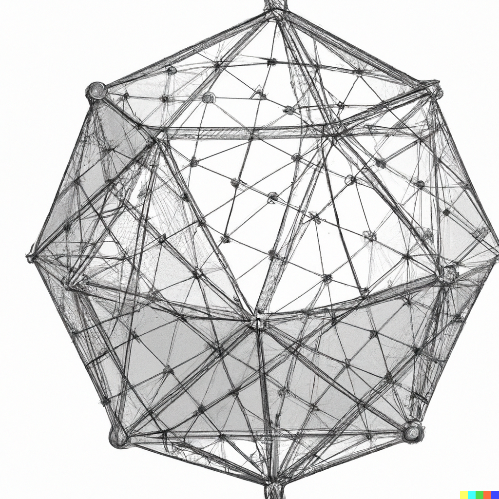

<p align="center">
    
</p>

<h1 align="center">Dantzig: A Rust-powered LP library for Python</h1>

<p align="center">
    <a href="http://mypy-lang.org/"></a>
    <a href="https://github.com/psf/black"></a>
    <a href="https://pycqa.github.io/isort/"></a>
    <a href="https://opensource.org/licenses/MIT"></a>
</p>

Dantzig is a lightweight and concise linear programming solver suitable for small 
and large-scale problems alike.

Dantzig is implemented in both Rust and Python, meaning you get the expressiveness 
and flexibility of a Python frontend plus the raw computing speed of a Rust backend. 

Dantzig supports

- A solver featuring a parametric self-dual algorithm
- Arbitrarily restricted variables, including completely unrestricted free variables
- `==`, `<=`, and `>=` constraints
- Both minimization and maximization problems
- A numerically stable LU factorization with partial pivoting routine for robust linear algebra operations
- Memory-efficient sparse matrix representations
- Modern Python type-checking

:warning: Dantzig is under active development. Please help us improve the library by reporting any issues!. 

### Installation

Dantzig supports Python 3.10+ and can be installed with `pip`.

```shell
pip install dantzig 
```

### Design Philosophies

Dantzig prides itself on being both **lightweight** (zero-dependency) and **concise**.
The API is designed to be extremely expressive and terse, saving you keystrokes without 
sacrificing clarity. To this end, Dantzig provides several short aliases for common
classes and methods.

A few examples are listed below,

- `Var == Variable`
- `Min == Minimize`
- `Max == Maximize`
- `Var.free() == Variable(lb=0.0, ub=0.0)`
- `Var.nn() == Var.nonneg() == Variable(lb=0.0, ub=None)`
- `Var.np() == Var.nonpos() == Variable(lb=None, ub=0.0)`

### Examples

```python
import dantzig as dz

x = dz.Variable(lb=0.0, ub=None)
y = dz.Variable(lb=0.0, ub=None)
z = dz.Variable(lb=0.0, ub=None)

soln = dz.Minimize(x + y - z).subject_to(x + y + z == 1).solve()

assert soln.objective_value == -1.0
assert soln[x] == 0.0
assert soln[y] == 0.0
assert soln[z] == 1.0
```

Using aliases, the previous example can alternately be written

```python
from dantzig import Min, Var

x = Var.nn()
y = Var.nn()
z = Var.nn()

soln = Min(x + y - z).st(x + y + z == 1)
```


### Road Map

- [ ] Mixed integer linear programing (MILP)
- [ ] SIMD-accelerated linear algebra operations
- [ ] General optimizations to make the library competitive with `ortools`
